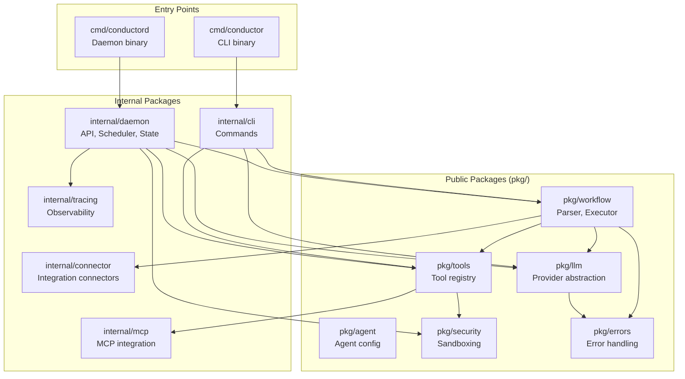

# Component Diagram

Internal package structure and dependencies.

## Package Overview



## Package Details

### Public Packages (`pkg/`)

These packages form Conductor's public API and can be imported by external projects.

| Package | Purpose | Key Types |
|---------|---------|-----------|
| `pkg/workflow` | Workflow definition, parsing, execution | `Definition`, `Step`, `Executor` |
| `pkg/llm` | LLM provider abstraction | `Provider`, `Request`, `Response`, `TokenUsage` |
| `pkg/agent` | Agent configuration and state | `Config`, `State` |
| `pkg/tools` | Tool registry and execution | `Registry`, `Tool`, `Invocation` |
| `pkg/security` | Security profiles and sandboxing | `Profile`, `Manager`, `Sandbox` |
| `pkg/errors` | Typed errors with context | `ConfigError`, `ValidationError`, etc. |

### Internal Packages (`internal/`)

Implementation details not exposed as public API.

| Package | Purpose |
|---------|---------|
| `internal/daemon` | Daemon server: API handlers, scheduler, state |
| `internal/cli` | CLI command implementations |
| `internal/connector` | Connector framework (GitHub, Slack, etc.) |
| `internal/mcp` | MCP server integration |
| `internal/tracing` | OpenTelemetry integration, correlation IDs |

## Key Interfaces

### LLM Provider

```go
type Provider interface {
    Complete(ctx context.Context, req *Request) (*Response, error)
    Stream(ctx context.Context, req *Request) (<-chan StreamEvent, error)
    Name() string
    Models() []ModelInfo
}
```

### Tool

```go
type Tool interface {
    Name() string
    Description() string
    Schema() map[string]any
    Execute(ctx context.Context, input map[string]any) (any, error)
}
```

### Connector

```go
type Connector interface {
    Name() string
    Operations() []Operation
    Execute(ctx context.Context, op string, params map[string]any) (any, error)
}
```

## Dependency Flow

The architecture follows a layered design:

1. **Entry points** (`cmd/`) import internal command packages
2. **Internal packages** import public packages from `pkg/`
3. **Public packages** can import each other but not internal packages
4. **Core packages** (`workflow`, `llm`) have minimal dependencies

This ensures `pkg/` packages can be imported independently for embedding.

---
*See [Execution Flow](execution-flow.md) for runtime behavior.*
