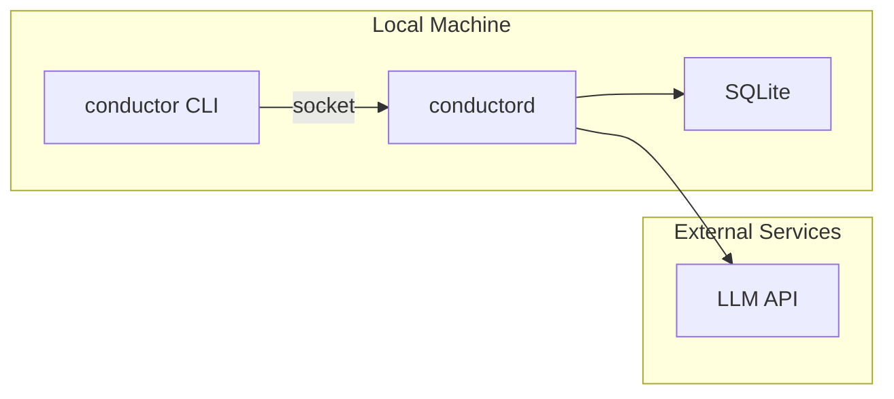
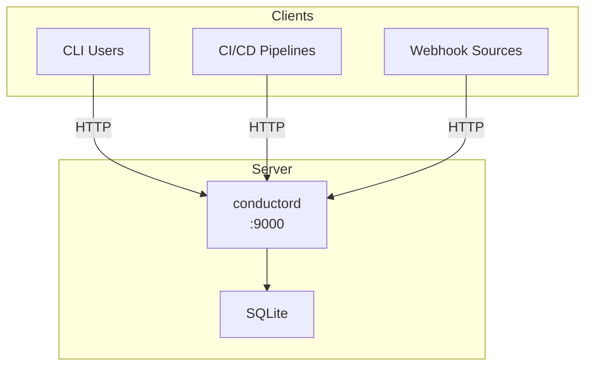
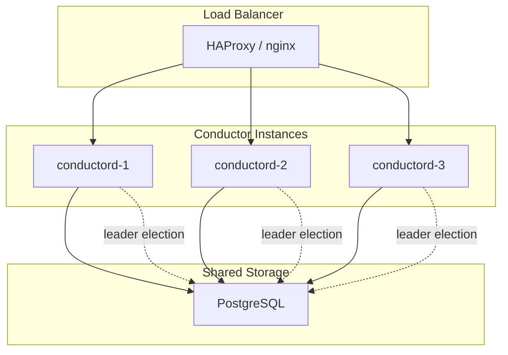
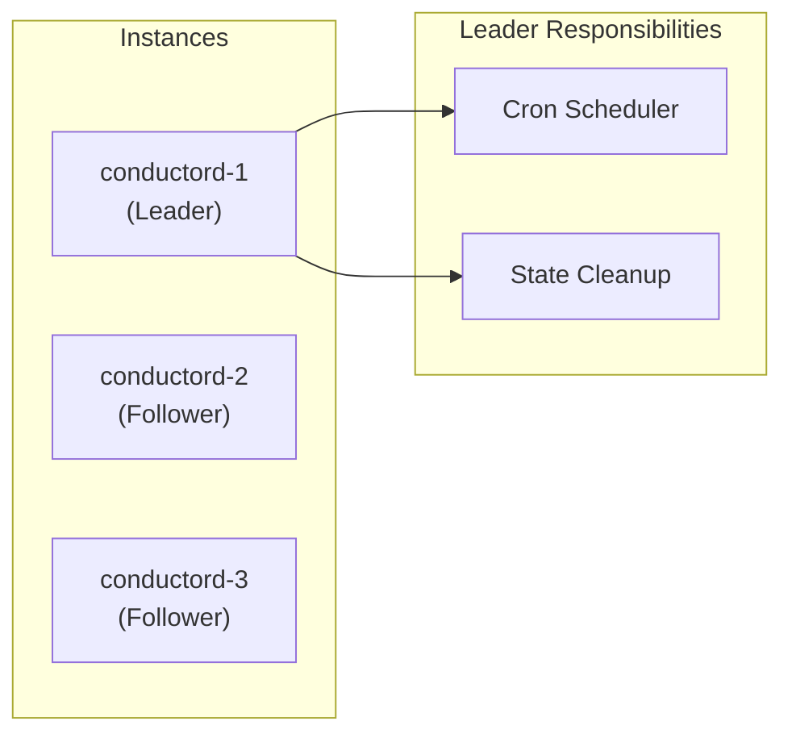
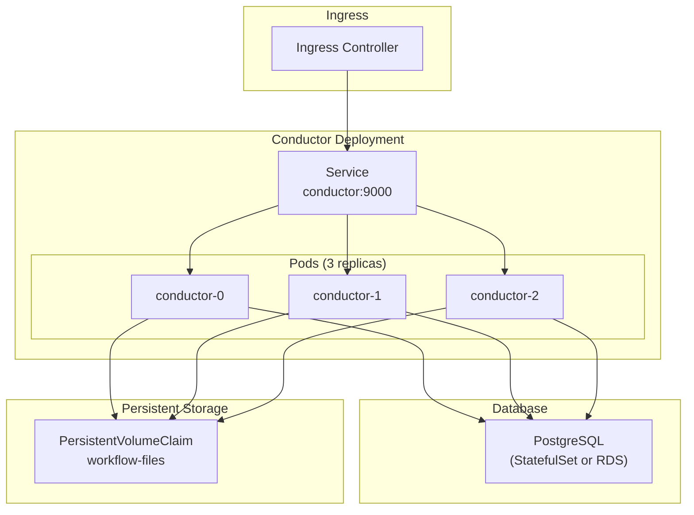
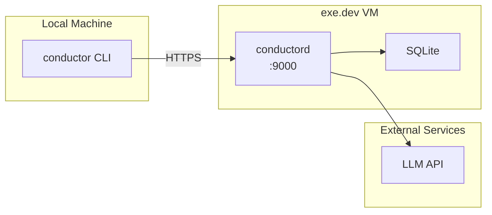
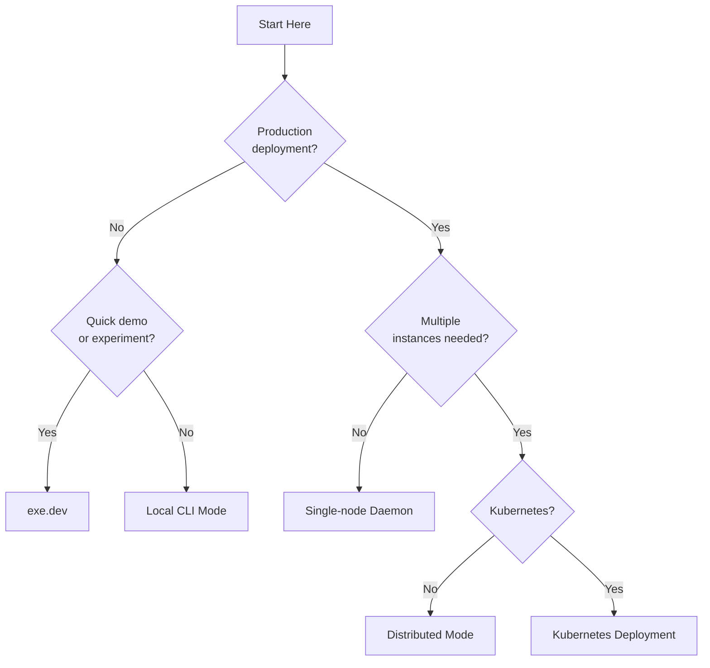

# Deployment Modes

Conductor supports multiple deployment topologies for different use cases.

## Mode Comparison

| Mode | Use Case | State Backend | Scaling |
|------|----------|---------------|---------|
| Local CLI | Development, one-off runs | SQLite | Single process |
| Single-node Daemon | Small teams, CI/CD | SQLite | Single process |
| [exe.dev](/deploy/exe.dev/) | Quick demos, experiments | SQLite | Single VM |
| Distributed | Production, high availability | PostgreSQL | Horizontal |
| Kubernetes | Cloud-native deployment | PostgreSQL | Auto-scaling |

## Local CLI Mode

Direct execution for development and testing.



**Setup:**
```bash
# Start daemon
conductord &

# Run workflows
conductor run workflow.yaml
```

**Characteristics:**
- Default mode, zero configuration
- State persisted in `~/.conductor/conductor.db`
- Socket at `~/.conductor/conductor.sock`

## Single-node Daemon Mode

For CI/CD and small team deployments.



**Setup:**
```bash
# Start with HTTP listener
conductord --listen :9000

# Configure CLI to use remote
export CONDUCTOR_HOST=http://server:9000
conductor run workflow.yaml
```

**Characteristics:**
- Single instance handles all requests
- HTTP API for remote access
- Suitable for < 100 concurrent workflows

## Distributed Mode

High-availability production deployment.



**Setup:**
```bash
# Start each instance with PostgreSQL backend
conductord \
  --listen :9000 \
  --backend postgres \
  --postgres-url "postgres://user:pass@db:5432/conductor"
```

**Characteristics:**
- PostgreSQL for shared state
- Leader election via advisory locks
- Job queue with `SELECT FOR UPDATE SKIP LOCKED`
- Any instance can handle any request

### Leader Election



Only the leader runs:
- Cron schedule evaluation
- Expired state cleanup
- Background maintenance tasks

All instances handle:
- API requests
- Workflow execution
- Webhook processing

## Kubernetes Deployment

Cloud-native deployment with auto-scaling.



**Example Deployment:**
```yaml
apiVersion: apps/v1
kind: Deployment
metadata:
  name: conductor
spec:
  replicas: 3
  selector:
    matchLabels:
      app: conductor
  template:
    spec:
      containers:
      - name: conductor
        image: ghcr.io/tombee/conductor:latest
        args:
        - --backend=postgres
        - --postgres-url=$(DATABASE_URL)
        env:
        - name: DATABASE_URL
          valueFrom:
            secretKeyRef:
              name: conductor-secrets
              key: database-url
        ports:
        - containerPort: 9000
        livenessProbe:
          httpGet:
            path: /v1/health
            port: 9000
        resources:
          requests:
            memory: "256Mi"
            cpu: "100m"
          limits:
            memory: "1Gi"
            cpu: "1000m"
```

**Characteristics:**
- Horizontal Pod Autoscaler based on queue depth
- Health checks for automatic recovery
- Secrets via Kubernetes Secrets
- Prometheus metrics at `/metrics`

## exe.dev Deployment

Lightweight VM hosting with minimal setup.



**Setup:**
```bash
# Create VM
ssh exe.dev new --name=conductor

# Install (see deploy/exe.dev/README.md for full instructions)
ssh exe.dev ssh conductor
curl -fsSL .../install-conductor.sh | bash

# Configure local CLI
export CONDUCTOR_HOST=https://conductor-xxx.exe.dev
export CONDUCTOR_API_KEY=<key-from-install>
```

**Characteristics:**
- Deploy in under 5 minutes
- Persistent disk for SQLite storage
- API key authentication required
- Best for demos, experiments, and small teams

See [deploy/exe.dev/](/deploy/exe.dev/) for complete setup guide.

## Choosing a Mode



---
*See [Architecture Overview](overview.md) for detailed component documentation.*
