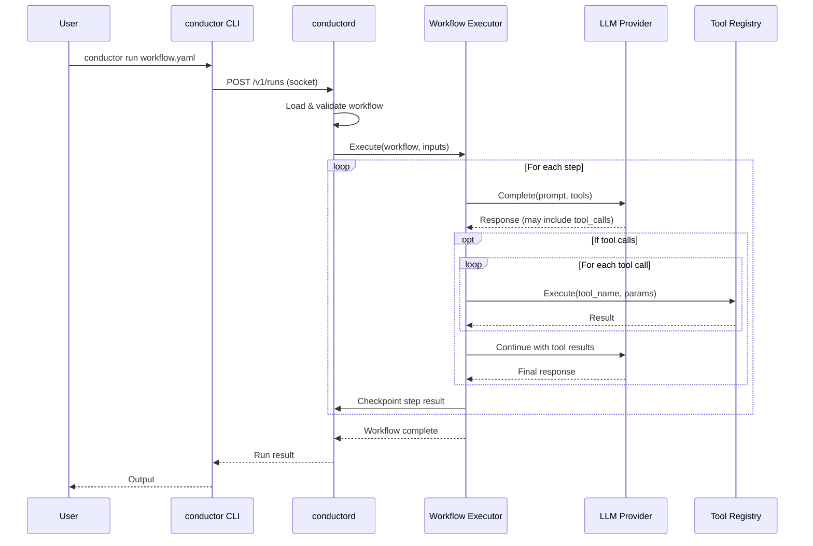
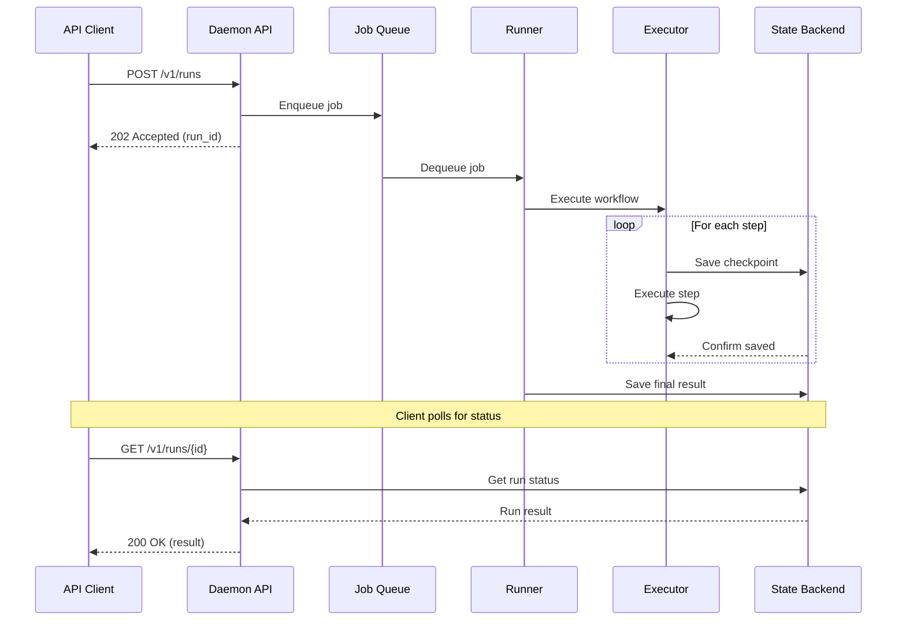
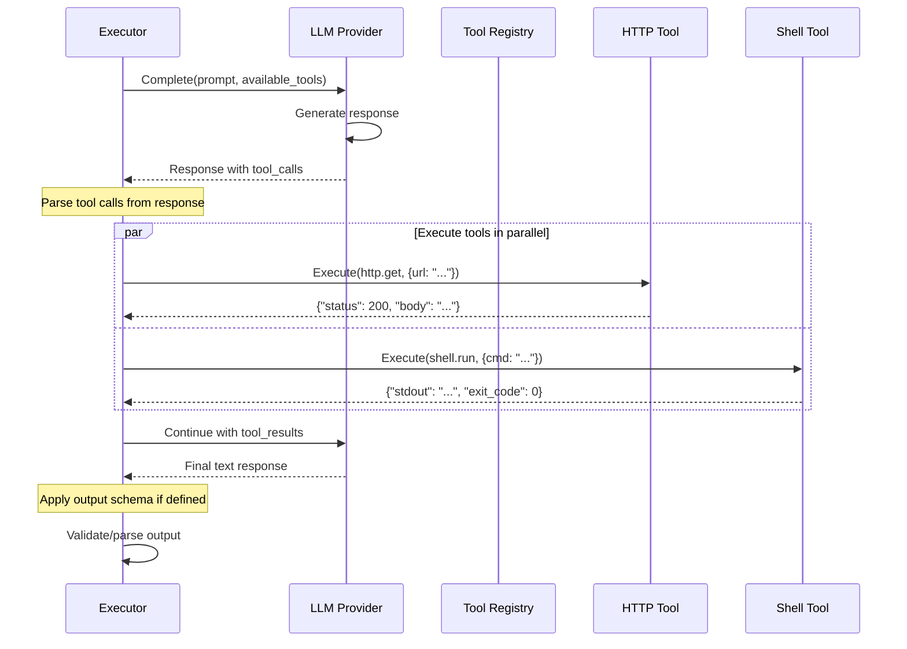
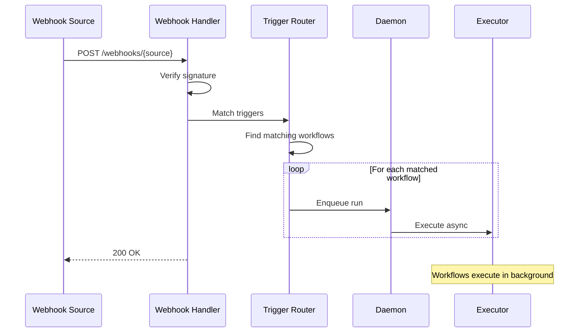
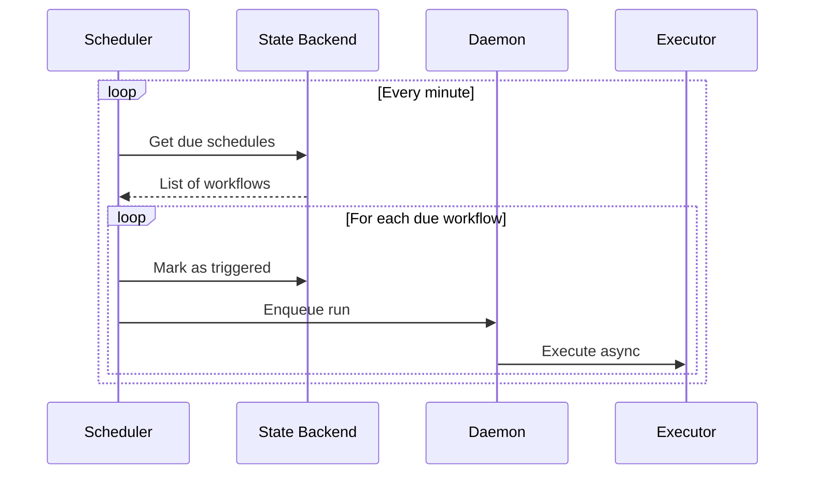
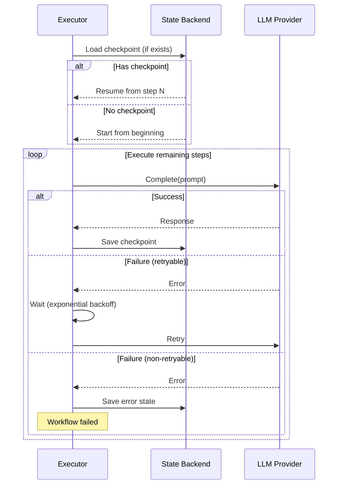

# Execution Flow Diagrams

Sequence diagrams showing how workflows execute at runtime.

## CLI Workflow Execution

When a user runs `conductor run workflow.yaml`:



## Daemon API Workflow

When an external client triggers a workflow via API:



## LLM Step Execution

Detailed view of a single LLM step with tool use:



## Webhook Trigger Flow

When a webhook triggers a workflow:



## Scheduled Workflow Flow

When a cron schedule triggers a workflow:



## Error Recovery Flow

How the system recovers from failures:



## Key Concepts

### Checkpointing

- State saved after each step
- On crash, resume from last checkpoint
- No duplicate LLM calls on recovery

### Tool Execution

- Tools run in parallel when independent
- Sandboxed based on security profile
- Results passed back to LLM in tool_results

### Streaming

For real-time output, clients can use SSE:

```
GET /v1/runs/{id}/logs
Accept: text/event-stream

data: {"type": "step_start", "step_id": "analyze"}
data: {"type": "token", "content": "The"}
data: {"type": "token", "content": " code"}
data: {"type": "step_end", "step_id": "analyze"}
```

---
*See [Deployment Modes](deployment-modes.md) for infrastructure options.*
