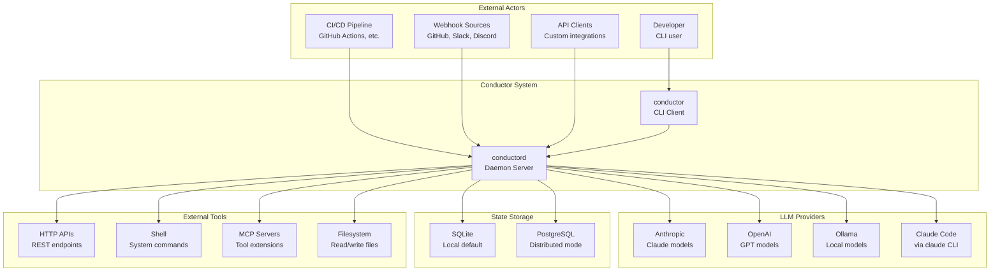

# System Context Diagram

High-level view of Conductor and its external interactions.

## Overview

## Component Descriptions

### External Actors

| Actor | Description |
|-------|-------------|
| **Developer** | Runs workflows via CLI, manages configuration |
| **CI/CD Pipeline** | Triggers workflows via API or webhooks |
| **Webhook Sources** | GitHub PRs, Slack messages, Discord events |
| **API Clients** | Custom tools built on Conductor API |

### Conductor System

| Component | Description |
|-----------|-------------|
| **conductor** | CLI client, communicates with daemon via socket |
| **conductord** | Daemon server, handles all workflow execution |

### LLM Providers

| Provider | Use Case |
|----------|----------|
| **Anthropic** | Primary provider (Claude models) |
| **OpenAI** | Alternative provider (GPT models) |
| **Ollama** | Local models, no network required |
| **Claude Code** | Zero-config via `claude` CLI if installed |

### State Storage

| Backend | When to Use |
|---------|-------------|
| **SQLite** | Single-node, local development |
| **PostgreSQL** | Distributed mode, production |

### External Tools

| Tool | Purpose |
|------|---------|
| **HTTP** | Call REST APIs |
| **Shell** | Execute system commands |
| **MCP** | Connect to Model Context Protocol servers |
| **Files** | Read/write local files |

## Key Relationships

1. **CLI to Daemon**: All CLI commands route through the daemon (Unix socket or HTTP)
2. **Daemon to Providers**: Daemon manages provider credentials and rate limiting
3. **Daemon to Storage**: Persists workflow state, checkpoints, and execution history
4. **Daemon to Tools**: Executes tool calls requested by LLM during workflow steps

---
*See [Components](components.md) for internal package structure.*
